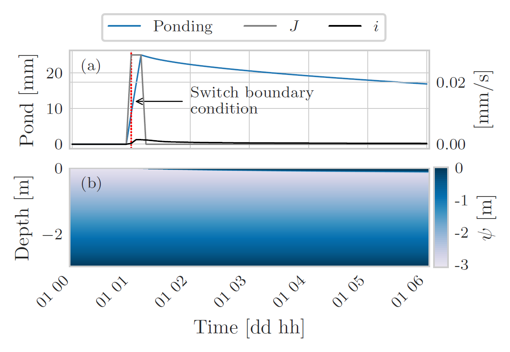

# OMS Project WHETGEO1D
`WHETGEO1D` is a physically based model simulating the water and energy budgets in a soil column. `WHETGEO1D` is written in Java,  works under the [`Object Modeling System v3 (OMS3)`](https://abouthydrology.blogspot.com/2017/08/oms-3-essentials.html)(David et al., 2013) framework and it is part of the `GEOframe` system ([Formetta et al., 2014](https://doi.org/10.1016/j.envsoft.2014.01.019), [Bancheri, 2017](http://eprints-phd.biblio.unitn.it/2679/)). It was produced as part of the Ph.D. work by Niccolò Tubini.

With `WHETGEO1D` it is possible to solve

- the Richardson-Richards equation, conventionally known as Richards’ equation;
- The heat diffusion equation considering the surface energy budget and the phase change of water as done in [Tubini et al. (2020)](https://tc.copernicus.org/preprints/tc-2020-293/);
- The heat advection-diffusion equation coupled with the Richardson-Richards equation.

    
     
    A synthetic simulation performed with WHETGEO1D to simulate the inflitration excess runoff. Panel (a) shows a comparison between the rainfall intensity J and actual soil infiltration i. The rainfall intensity exceeds the
actual infiltration rate so water builds up at the soil surface (blue line). Panel (b) shows the time evolution of the water suction within the
soil. From the numerical point of view, as water builds up at the soil surface it would be necessary to switch the boundary condition, from
Neumann type to Dirichlet type.

Hoping that WHETGEO will _whet_ your curiosity.

# Website
- [GEOframe](https://geoframe.blogspot.com/2021/05/whetgeo-1d.html)
- [Object Modeling Sytem (OMS3)](https://alm.engr.colostate.edu/cb/project/oms)

# GEOframe environment installation

GEOframe programs run on Java 8. `WHETGEO1D` can be run either within the OMS3 Console or by using [Docker](https://hub.docker.com/r/omslab/oms/).
 
## Running WHETGEO1D from the OMS3 console
- As first step it is necessary to install the JDK 8. There are two options:
  - Download open JDK 8 LTS from https://adoptopenjdk.net/
    - Install it
    - find the JAVA_HOME
      - on Windows open a terminal and run `where javac`
      - on Mac open a terminal and run `where java`
  or
  - install Anaconda
    - create the environment geoframe_vicenza. This install a JDK 8 on your laptop. To create an enviroment open the Anaconda prompt
    - open Anaconda prompt
      - set in the folder containing the file *geoframe_vicenza.yaml*
      -  `conda env create -f geoframe_vicenza.yaml`
      -  `conda activate geoframe_vicenza`
    - find the JAVA_HOME
      - from the Anaconda prompt `echo JAVA_HOME`
    
- Download the OMS v3 Console version 3.6.28 from  https://alm.engr.colostate.edu/cb/wiki/16961
- Unzip the OMS Console and 
  - on Windows run the `console.bat` file
  - on Mac or Linux open a terminal and execute `./console.sh &`

- In the console setting, select the panel Run and set the Java path to the previously installed JDK. The Java path can be  

## Running WHETGEO1D from Docker
Please refers to the guidelines at https://hub.docker.com/r/omslab/oms/. Please use the version `0.3_py3`.

# Project documentation
In the folder `Documentation` you can find
- `_README.ipynb` containing a description of the folder structure;
- `00_How_to_Read_NetCDF.ipynb` containing a brief introduction to [NetCDF](https://www.unidata.ucar.edu/software/netcdf/docs/index.html) and the Python library [xarray](http://xarray.pydata.org/en/stable/index.html);
- `00_OMS_Timeseries.ipynb` showing the structure of a .csv file OMS compliant and how to prepare timeseries input;
- `00_Richards_computational_grid.ipynb` containing a detailed descritption of how to prepare the input file to define the computational grid;
- `00_WHETGEO1D_Richards.ipynb` containing the documentation to setup the .sim file to solve the Richards' equation.

# Source code
Here you can find the source code of [WHETGEO1D](https://github.com/geoframecomponents/WHETGEO-1D).

The source codes of the classes used to solve the water and energy budgets and the components to deal with I/O are:
- [Buffer](https://github.com/geoframecomponents/Buffer) contains the source code of the buffer componets. 
- [ClosureEquation](https://github.com/geoframecomponents/ClosureEquation) contains the source code of the parametrization describing the hydraulic and thermal properties of the soil.
- [NetCDF](https://github.com/geoframecomponents/NetCDF) contains the source code of the components to read and write netCDF files,
- [Numerical](https://github.com/geoframecomponents/Numerical) contains the source code the classes dealing with the algorithms to solve linear systems and to linearize nonlinear systems

# Contributing
Your contributions are always welcome! Please take a look at the [contribution guidelines first](http://geoframe.blogspot.com/2020/05/geoframe-community-publication-policy.html).

# Acknowledgements

-  Niccolò Tubini, Riccardo Rigon developed the theoretical aspects of the model (Authors). 
-  Niccolò Tubini, Riccardo Rigon designed the first version of the code (Authors)
-  Niccolò Tubini implemented and deployed it (Authors)
-  Riccardo Rigon provided financial support
-  Niccolò Tubini and Concetta D'Amato wrote the documentation
-  Niccolò Tubini was supported by a Ph.D. grant by [DICAM-UniTrento](https://www.unitn.it/dricam/) by the Italian MIUR Project (PRIN 2017)
“WATer mixing in the critical ZONe: observations and predictions under environmental changes-WATZON” (project code: 2017SL7ABC).
-  We thank Professor Vincenzo Casulli and Professor Michael Dumbser for their fruitful discussions on the numerical aspects of the work. 

